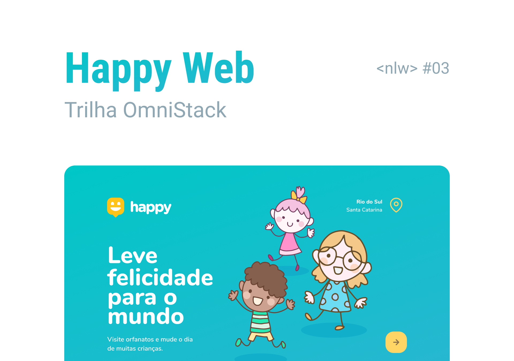

<p align="center">
  
</p>

# Happy
     


<p align="center">
  
</p>

<p align="center">
  
</p>

<p align="center">
  
</p>


* [Content (en-US)](#section-en_us)
* [Conteúdo (pt-BR)](#secao-pt_br)

---

## About the project <a id="section-en_us"></a>

Happy is a platform idealized to bring info about orphanages nearby, so it can be easier to found them, facilitating the adoption process.
The backend was created using Node.js and it's responsible for register a new orphanage, with images and infos of the place, and also return data from orphanages already registered.
The web application was made in React, and is responsible for sending the registration data of a new orphanage, in addition to dynamically showing on a map all orphanages already registered.
The mobile app was made in React Native using expo, and has the same features as the web app, in a different flux.

## Content
  * [Techs](#techs)
  * [How to run the project](#installation)
    * [Installation - Back-end](#installation-back)
    * [Installation - Front-end](#installation-front)
    * [Installation - Mobile](#installation-mobile)

## Techs <a id="techs"></a>

- [x] NodeJS
- [x] Express
- [x] Typeorm
- [x] React
- [x] Axios
- [x] Leaflet
- [x] Expo
- [x] React Native
- [x] React Native Maps

## How to execute the project <a id="installation"></a>
To execute the project, you'll need to have Node and NPM or Yarn installed to setup all the dependencies.


### Installation - Back-end (Server and API) <a id="installation-back"></a>

```bash
cd server
npm install
npm run typeorm migration:run
npm run dev
```

If you are using Yarn, use this:
```bash
cd server
yarn install
yarn typeorm migration:run
yarn dev
```

### Installation - Front-end (Web) <a id="installation-front"></a>

```bash
cd web
npm install
npm run start
```

If you are using Yarn, use this:
```bash
cd web
yarn install
yarn start
```

After finishing installation, the web page will be open in your browser.

### Installation - Mobile (App) <a id="installation-mobile"></a>

Go to `api.ts` file inside `mobile/src/services`, and `backend/src/views/images_view.ts`, and change the IP to your machine's server IP.
If you need to install *Expo*, execute the following command: `yarn global add expo-cli`.
After, execute the project.


```bash
cd mobile
npm install
npm run start
```

If you are using Yarn, use this:
```bash
cd mobile
yarn install
yarn start
```

When executing the project, *Expo's* debug page will open in your browser.

To open the app in your mobile device, download *Expo's* app at Play Store or App Store and scan the QR code shown in the debug page, and wait until the installation finishes.

---

## Sobre o projeto <a id="secao-pt_br"></a>

O happy é uma plataforma que tem como objetivo trazer informações sobre orfanatos da região, para que possam ser encontrados mais facilmente, facilitando assim o processo de adoção. 
O servidor backend foi feito em Node.js e é responsável por fazer o cadastro de um novo orfanato, contendo imagens do lugar e suas informações, além de retornar dados sobre os orfanatos cadastrados. 
O aplicativo web foi feito em React, e é responsável por enviar as informações de cadastro de um novo orfanato, além de mostrar dinamicamente num mapa todos os orfanatos já cadastrados.
O aplicativo mobile foi feito em React native usando expo, e tem as mesmas funcionalidades do app web, em um fluxo diferente.

## Conteúdos 
  * [Tecnologias](#tecnlogias)
  * [Como executar o projeto](#instalacao)
    * [Instalação - Back-end](#instalacao-back)
    * [Instalação - Front-end](#instalacao-front)
    * [Instalação - Mobile](#instalacao-mobile)

## Tecnologias <a id="tecnologias"></a>

- [x] NodeJS
- [x] Express
- [x] Typeorm
- [x] React
- [x] Axios
- [x] Leaflet
- [x] Expo
- [x] React Native
- [x] React Native Maps

## Como executar o projeto <a id="instalacao"></a>
Para executar o projeto, você irá precisar ter o Node e o NPM ou Yarn instalados para baixar as dependências.


### Instalação - Back-end (Server e API) <a id="instalacao-back"></a>

```bash
cd server
npm install
npm run typeorm migration:run
npm run dev
```

Se estiver usando Yarn, utilize
```bash
cd server
yarn install
yarn typeorm migration:run
yarn dev
```

### Instalação - Front-end (Web) <a id="instalacao-front"></a>

```bash
cd web
npm install
npm run start
```

Se estiver usando Yarn, utilize
```bash
cd web
yarn install
yarn start
```

Quando terminar, a página da aplicação web será aberta no navegador.

### Instalação - Mobile (Aplicativo) <a id="instalacao-mobile"></a>

Vá no arquivo `api.ts` dentro de `mobile/src/services`, e no arquivo `backend/src/views/images_view.ts`, e coloque o ip da máquina que está executando o seu servidor.
Se precisar instalar o *Expo*, execute o comando `yarn global add expo-cli`.
Em seguida, execute o projeto

```bash
cd mobile
npm install
npm run start
```

Se estiver usando Yarn, utilize
```bash
cd mobile
yarn install
yarn start
```

Ao executar o projeto, a página de debug do *Expo* será aberta no seu navegador. 

Para executar o aplicativo no seu dispositivo, baixe o aplicativo *Expo* na Play Store ou App Store e faça o scan do código QR que será disponibilizado na página de debug, e aguarde a instalação.

---
###### Developed on Next Level Week from [Rocketseat](https://rocketseat.com.br) by [Gean Lucas](https://www.linkedin.com/in/geanlucaas/) :rocket:.